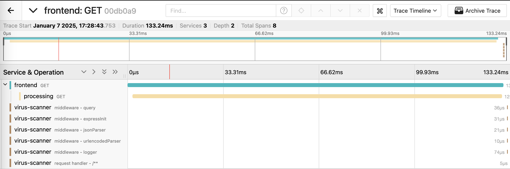

# docker compose quick start

You can turn an [app sim config](../specification/README.md) into a docker
compose file using the
[docker compose generator](../../scripts/generators/docker-compose/).

## Generate compose file

The generator is available as docker image and you can retrieve it by running

```shell
docker pull ghcr.io/cisco-open/app-simulator-generators-docker-compose:latest
```

To try it out, create the a file called `config.yaml` with the following content
in a new folder:

```yaml
services:
  frontend:
    type: java
    port: 3000
    endpoints:
      http:
        /upload:
          - http://processing/magicByte
          - http://processing/virus
  processing:
    type: java
    endpoints:
      http:
        /magicByte:
          - cache,128
        /virus:
          - http://virus-scanner/scan
  virus-scanner:
    type: nodejs
    endpoints:
      http:
        scan:
          - sleep,1500
          - call: error,500,Scan failed
            probability: 0.1
          - sleep,500
loaders:
  user-1:
    type: curl
    wait: 0
    sleep: 2
    urls:
      - http://frontend/upload
      - http://frontend/upload
      - http://frontend/upload
```

To generate a `docker-compose.yaml` from this file run

```shell
docker run --rm -t -i -v ${PWD}:/mnt cisco-open/app-simulator-generators-docker-compose --config /mnt/config.yaml --output /mnt/docker-compose.yaml
```

## Run application simulation

To run the simulation using the generated `docker-compose.yaml`, execute the
following in your terminal:

```shell
docker compose up
```

This will bring up the three services (`frontend`, `processing` and
`virus-scanner`) and a loader (`user-1`). Run `docker ps` to verify that all
services are up and running:

```shell
CONTAINER ID   IMAGE                                                   COMMAND                  CREATED         STATUS         PORTS                            NAMES
aebccbe1bc54   ghcr.io/cisco-open/app-simulator-services-java:edge     "/entrypoint.sh"         4 seconds ago   Up 3 seconds   8080/tcp, 0.0.0.0:3000->80/tcp   test-app-sim-frontend-1
75218ac52b90   ghcr.io/cisco-open/app-simulator-services-java:edge     "/entrypoint.sh"         4 seconds ago   Up 3 seconds   8080/tcp                         test-app-sim-processing-1
75d7433f85c0   ghcr.io/cisco-open/app-simulator-services-nodejs:edge   "docker-entrypoint.s…"   4 seconds ago   Up 3 seconds   80/tcp                           test-app-sim-virus-scanner-1
5f86a8738e15   ghcr.io/cisco-open/app-simulator-loaders-curl:edge      "/usr/bin/entrypoint…"   4 seconds ago   Up 3 seconds                                    test-app-sim-user-1-1
```

The loader will continuously load from the `/upload` endpoint. You can also
reach that endpoint yourself, either by opening <http://localhost:3000/upload>
in the browser or by running the following:

```shell
curl http://localhost:3000/upload
```

The `docker-compose.yaml` that was generated now works independent of the
generator. You can use it wherever you want and you can modify it to your needs.

## Adding OpenTelemetry and visualize in jaeger

If you want to quickly visualize the simulation, you can add OpenTelemetry using
the [Java agent](https://opentelemetry.io/docs/zero-code/java/agent/) and
Node.js
[`@opentelemetry/auto-instrumentations-node`](https://opentelemetry.io/docs/zero-code/js/)
and send trace data to [jaeger](https://www.jaegertracing.io/).

To do so, download the Java agent and Node.js package:

```shell
curl -L -O https://github.com/open-telemetry/opentelemetry-java-instrumentation/releases/latest/download/opentelemetry-javaagent.jar
echo {} > package.json
npm install @opentelemetry/auto-instrumentations-node
```

Next, create a
[`docker-compose.override.yaml`](https://docs.docker.com/compose/how-tos/multiple-compose-files/merge/)
with the following content:

```shell
services:
  frontend:
    environment:
      - JAVA_TOOL_OPTIONS=-javaagent:/mnt/opentelemetry-javaagent.jar
      - OTEL_RESOURCE_ATTRIBUTES=service.name=frontend
      - OTEL_EXPORTER=otlp
      - OTEL_EXPORTER_OTLP_ENDPOINT=http://jaeger:4318
    volumes:
      - ./opentelemetry-javaagent.jar:/mnt/opentelemetry-javaagent.jar
  processing:
    environment:
      - JAVA_TOOL_OPTIONS=-javaagent:/mnt/opentelemetry-javaagent.jar
      - OTEL_RESOURCE_ATTRIBUTES=service.name=processing
      - OTEL_EXPORTER=otlp
      - OTEL_EXPORTER_OTLP_ENDPOINT=http://jaeger:4318
    volumes:
      - ./opentelemetry-javaagent.jar:/mnt/opentelemetry-javaagent.jar
  virus-scanner:
    environment:
      - NODE_PATH=/mnt/node_modules
      - NODE_OPTIONS=-r "@opentelemetry/auto-instrumentations-node/register"
      - OTEL_RESOURCE_ATTRIBUTES=service.name=virus-scanner
      - OTEL_EXPORTER=otlp
      - OTEL_EXPORTER_OTLP_ENDPOINT=http://jaeger:4318
    volumes:
      - ./node_modules:/mnt/node_modules
  jaeger:
    image: jaegertracing/all-in-one
    ports:
      - "16686:16686"
      - "4317:4317"
      - "4318:4318"
```

The existing `docker-compose.yaml` and the newly created
`docker-compose.override.yaml` will be merged, such that the OpenTelemetry Java
agent and Node.js package are injected into the services. Once again start the
simulation:

```shell
docker compose up
```

This will bring up the three services for the simulation and additionally a
container running jaeger. In your browser you can navigate to
<http://localhost:16686/search> to see traces flowing through your system:



## Learn more

If you want to learn more about app-simulator and how you can use it for your
own needs, we recommend that you continue with the
[tutorial](../tutorial/1-two-java-services.md).
