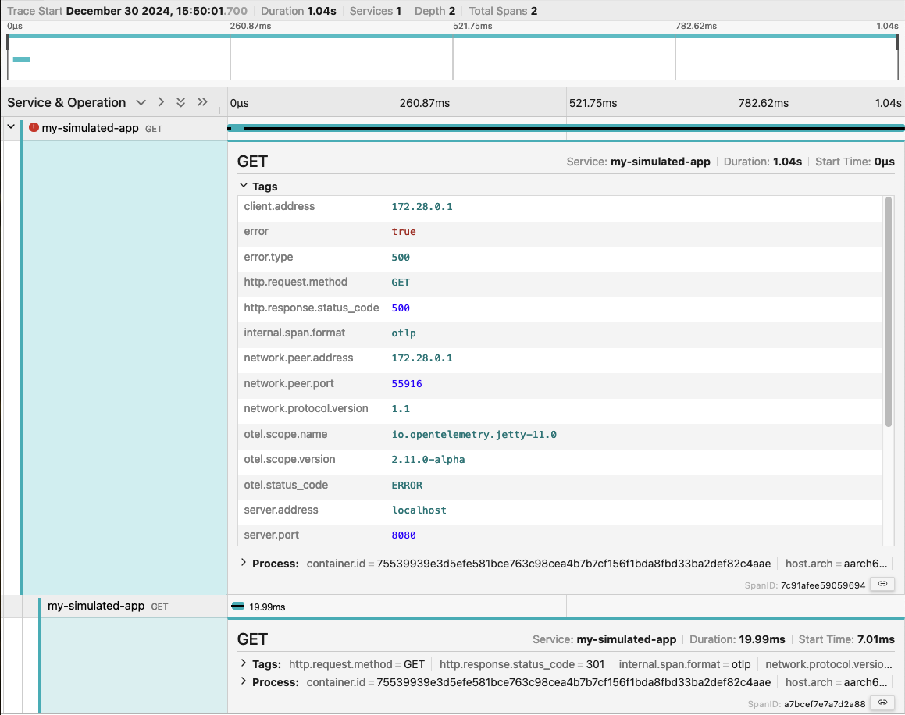

# Standalone container quick start

While you can build complex multi tier application simulations with the
generators for [kubernetes](kubernetes.md) or
[docker compose](docker-compose.md) it is possible to use the
[cisco-open/app-simulator container images](https://github.com/orgs/cisco-open/packages?repo_name=app-simulator)
standalone. In this document you will find a few standalone examples that
demonstrate this use case.

## Table Of Contents

## Java application with OpenTelemetry

If you are looking for a way to generate some sample telemetry with the
[OpenTelemetry Java agent](https://opentelemetry.io/docs/zero-code/java/agent/),
create a `config.json` with the following content:

```json
{
  "endpoints": {
    "http": {
      "/my/endpoint": [
        "http://github.com/",
        "sleep,1000",
        {
          "call": "error,500,oops",
          "probability": 0.25
        }
      ]
    }
  },
  "name": "frontend",
  "type": "java"
}
```

In the same folder, run the
[app-simulator-services-java](https://github.com/cisco-open/app-simulator/pkgs/container/app-simulator-services-java)
with Docker:

```shell
docker run -t -i --rm --volume ${PWD}/config.json:/config.json -p 8080:8080 ghcr.io/cisco-open/app-simulator-services-java:latest
```

This will start a Java based webserver listening on port 8080 for requests. Run
the following command a few times:

```shell
curl -v localhost:8080/my/endpoint
```

You will see that 1 in 4 requests will return a `500 Server Error`.

Add the
[OpenTelemetry Java agent](https://opentelemetry.io/docs/zero-code/java/agent/)
to create telemetry for the service.

Stop the currently running container and download the Java agent:

```shell
https://github.com/open-telemetry/opentelemetry-java-instrumentation/releases/latest/download/opentelemetry-javaagent.jar
```

Restart the container with the following settings:

```shell
docker run -t -i --rm \
           --volume ${PWD}/config.json:/config.json \
           --volume ${PWD}/opentelemetry-javaagent.jar:/opt/opentelemetry-javaagent.jar \
           -e JAVA_TOOL_OPTIONS="-javaagent:/opt/opentelemetry-javaagent.jar" \
           -e OTEL_SERVICE_NAME="my-simulated-app" \
           -e OTEL_TRACES_EXPORTER=logging \
           -e OTEL_METRICS_EXPORTER=logging \
           -e OTEL_LOGS_EXPORTER=logging \
           -p 8080:8080 \
           ghcr.io/cisco-open/app-simulator-services-java:latest
```

This will start the Java based webserver with OpenTelemetry enabled. Re-run the
previous command to send some requests:

```shell
curl -v localhost:8080/my/endpoint
```

The Java agent will print telemetry to the console, e.g.:

```shell
[otel.javaagent 2024-12-30 14:31:24:972 +0000] [qtp1467981309-27] INFO io.opentelemetry.exporter.logging.LoggingSpanExporter - 'GET' : bbf7fc4f97e47a2bdef475f928099d62 31baa1f78b9c2701 SERVER [tracer: io.opentelemetry.jetty-11.0:2.11.0-alpha] AttributesMap{data={url.scheme=http, thread.name=qtp1467981309-27, network.protocol.version=1.1, network.peer.port=61224, user_agent.original=curl/8.7.1, http.request.method=GET, server.port=8080, url.path=/my/endpoint, thread.id=27, error.type=500, server.address=localhost, client.address=172.17.0.1, http.response.status_code=500, network.peer.address=172.17.0.1}, capacity=128, totalAddedValues=14}
```

As a final step, start
[jaeger](https://www.jaegertracing.io/docs/getting-started/) and send traces to
it via OTLP:

```shell
docker run --rm --name jaeger \
  -p 16686:16686 \
  -p 4317:4317 \
  -p 4318:4318 \
  --network app-sim \
  jaegertracing/all-in-one:1.64.0
```

and

```shell
docker run -t -i --rm \
           --volume ${PWD}/config.json:/config.json \
           --volume ${PWD}/opentelemetry-javaagent.jar:/opt/opentelemetry-javaagent.jar \
           -e JAVA_TOOL_OPTIONS="-javaagent:/opt/opentelemetry-javaagent.jar" \
           -e OTEL_SERVICE_NAME="my-simulated-app" \
           -e OTEL_TRACES_EXPORTER=otlp \
           -e OTEL_EXPORTER_OTLP_TRACES_ENDPOINT=http://jaeger:4318/v1/traces \
           -e OTEL_METRICS_EXPORTER=none \
           -e OTEL_LOGS_EXPORTER=none \
           -p 8080:8080 \
           --network app-sim \
           ghcr.io/cisco-open/app-simulator-services-java:latest
```

A span for a request that returned a `500 Server Error` looks like the following
in jaeger:



## curl loader as base image

Like any other container image, you can use
[cisco-open/app-simulator container images](https://github.com/orgs/cisco-open/packages?repo_name=app-simulator)
as base images, e.g.:

```Dockerfile
FROM ghcr.io/cisco-open/app-simulator-loaders-curl:latest

WAIT=0
SLEEP=5
URLS=https://github.com/cisco-open/app-simulator
```

Build the docker image:

```shell
docker build -t my-load-generator .
```

Run your custom load generator for
<https://github.com/cisco-open/app-simulator>:

```shell
docker run --rm -t -i my-load-generator
```
